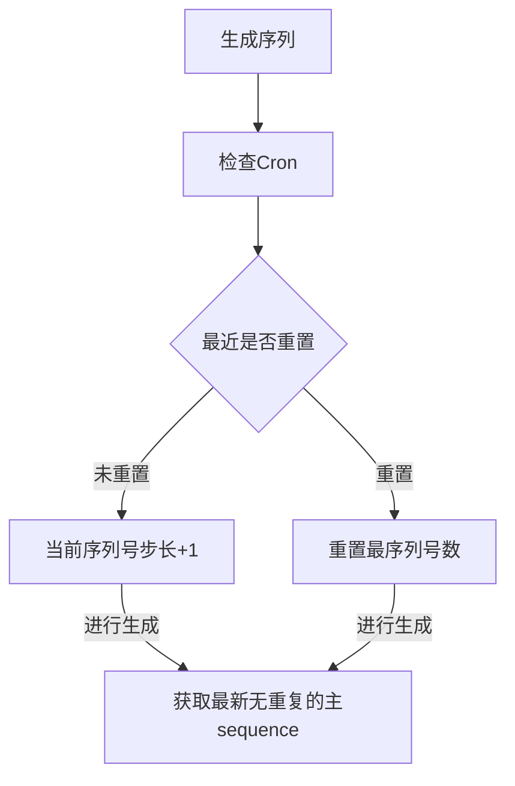
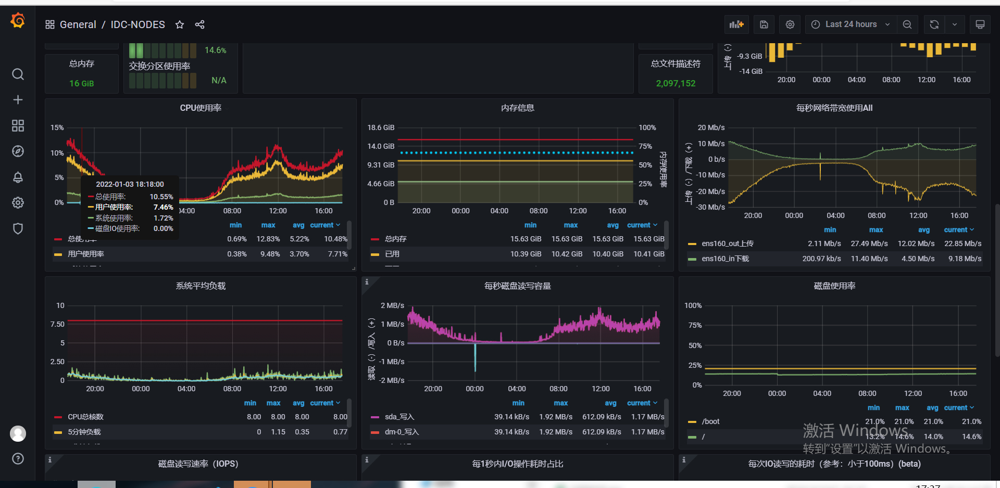

# Theta
 
 - **一款数据库实现的分布式 Sequence：**   
这个小组件的小巧，精炼，不同于中间件，因为这个组件不仅仅是基于MySQL
实现的一款分布式序列号生成组件，你还可以通过ORACLE、DB2 (目前仅有)来实现，
 您可以通过Spring中的.yml文件自定义你的序列号生成方法，再通过sharding-jdbc,
这分布式的分库、分表的工具进行插入你理想的Primary，当然我的目的是做到尽可能的
方便用户扩展，详细后面有会讲到他的使用方法。

 - **关于Theta构思：**  
  首先想到的是使用MySQL基于，MVVC支持的Innodb引擎来维护每次序列号生成的顺序，防止出现重复的
主键。同时我们还需要使用到数据库的事务，当然这也是为了防止出现多个线程，同时操作数据库，每条线程
使用了重复的序列号。也就是说，每当我们需要生成一个序列号的时候，Theta会帮助我们去调度事务，
去给用户当前使用的唯一序列号进行自增，也就是说`ThetaSegment`是通过数据库的`X`锁保证了多服务节点的序列号唯一（目前1.0.0的问题如果当前序列号大于了最大时间,Theta
会帮助我们重置最最大个数的,于此同时为了防止出现问题我们还会判断此时的更新时间，判断当前
的序列号配置是否再之前被其他线程重置过，当然这个方法不是一个最终的解决办法，我最终可能会按照Leaf
的双Buffer实现方式继续优化）

*Theta*的核心就是这张表
其中包括了：    
当前序列号的步长 ==> `step`
当前变送hi ==> `currentSequenceInServer`
当前序列号的步长 ==> `maxSequenceInServer`
当前序列号的步长 ==> `lastUsedTime`

| 唯一标识 | 当前序列号 | 步长 | 最打序列号数  | 时间  | 更新时间 |
|:---------:|-------|-------|-------|-----|------|
|     1     | 200   | 100 | 9999999 | 2021-12-22 23:59:59 |  2021-12-22 23:59:59 |
|     2     | 100   | 100 | 9999999 | 2021-01-22 21:00:59 |  2021-12-22 23:59:59 |
|     3     | 502   | 100 | 9999999 | 1997-12-23 12:00:00 |  2021-12-22 23:59:59 |

- **序列号流程**

- 关于Theta的使用  
  - *准备工作*:首先你要使用Theta你需要准备一个数据库，这里以MySQl为例,若用户用`SharingJDBC`这种

  分库分表的数据源， 需要指定默认的默认的数据源，若没有指定默认的数据源，可能会导致多数据源情况下的
  重复主键的问题，而且者是不可避免的,而且这是由于SharingSphere默认通过DataSource来寻找Theta中的
  SequenceConfig的相关来获取目前服务器的序列号的生成步长和是否满足重置的的时间。
```yaml
    sharding:
      default-data-source-name: [这里指定的是默认的数据源]
```
 `ShardingSphere`官方文档[default-data-source-name](https://shardingsphere.apache.org/document/4.1.1/en/manual/sharding-jdbc/configuration/config-spring-namespace/#shardingsharding-rule-)

  - *开始使用*:做好相关数据库的准备和数据源配置以后，就可以顺利的开始了。Theta依赖于Spring来使用，
  所以，当我么以来了Theta后,Spring就已经帮我门注入了所有常用的`Generator`，对于不同的`Generator`
  我们采取的生成策略是不一样的，当然了用户也可以通过实现`Segment`来实现不同的一个客制化的生成策略.
  下面是一个我们在.yaml文件中的配置信息，以下包含了一些常用的组合凡方式,通过这样的方式。
  ```yaml
  theta:
    sequence:
      # 是否启用Theta
      available: true 
      sequenceConfigs:
        #8（8位时间yyyyMMdd）10(顺序号，数字范围百亿) 3（类型）2（分库号）3（分表号）4（应用节点号）6（顺序号，百万）。
        - id: myCompositeString
          type: compositeString
          segmentConfigs:
          - id: date
            type: dateSegment
            args: {pattern: 'yyyyMMdd'}
          - id: db
            type: dbNumberSegment
            args: {id: 'myDbNumberSegment', maxSequenceValue: '9999999999', length: '10'}
          - id: type
            type: fixedStringSegment
            args: {segmentString: 'THETA'}
          - id: databaseIndex
            type: hashSegment
            args: {length: '2', defaultMod: '2', hashField: 'hashField', defaultValueField: 'databaseDefaultValue'}
          - id: tableIndex
            type: hashSegment
            args: {length: '3', defaultMod: '128', hashField: 'hashField', startField: 'tableStart'}
          - id: nodeNo
            type: fixedStringSegment
            args: {propertyName: 'nodeNo', length: '1', segmentString: '1'}
          - id: random
            type: randomStringSegment
            args: {length: '6'}
        - id: dataSequence
          type: compositeString
          segmentConfigs:
          - id: date
            type: dateSegment
            args: {pattern: 'yyyyMMdd'}
          - id: variableSegment
            type: variableSequenceSegment
            args: {pattern: '#{settleBatch}#{userId}#{batchDate}', upperCase: 'true'}

 ```
  接下来，我们就是用熟悉的Java代码就可以就可以使用Theta了。

```java
public class Theta{
    
  public static void main(String[] args) {
    Sequence sequence = new Sequence("myCompositeString");
    String sequence = sequence.getSequence("myCompositeString");
    System.out.println(sequence);//当前生成的数据序列号
  }
}
```

- **Theta 后续和现在需要解决的问题**   
  因为Theta需要搭配一些分裤分表的组件来使用，所以Theta后续要做的就是整合SharingJDBC,或者MyCat这种分库分表的工具
  所以后续，我会整合这两个组件，方便用户使用，和对应相应生成组件配合ShardingJDBC多数据源下寻找对应的数据，为了完
  成这些整合，会新的module下进行编写。

  - **Theta的实机结果**  
  这是一台8核16G的一台ESC云主机。在目前这种主机运行情况下的
  
    
  在目前太机器的访问的一台MySQl的Theta 还没有出现重复主键的问题，但是目前Theta还没有和美团Leaf一样机进行，解决闰秒  
  的问题。这也是Theta手续需要解决的问题
- **特别鸣谢** 
  1、Spring 
  2、ShardingSphere
  3、MySQL
  ......

