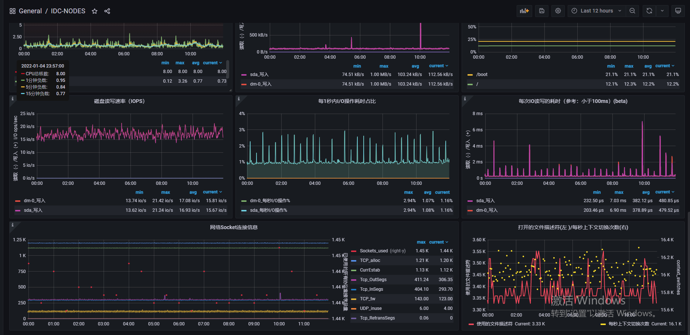

# Theta

- **关于Theta：**
  Theta名为"西塔"，此项目聚合常见的Web组件，对已有的中间件再次封装，使得开发人员使用"西塔"时候
  不去过度关注中间件的原理，开箱即用。并且在此基础上支持多种配置,以及灵活配置，并且支持常见的分布式 配置，
  以及配置动态刷新。减少项目中配置的组件配置冗余，以及管理，只要引入Theta,就可以方便使用，并且
  项目均采用SPI机制进行抽离，开发人员可以定制化选择的需要的工具进行使用Maven依赖进行管理。
  天然支持主流的分布式配置中心不限于Naocs,SpringCloudConfig。

目前Theta的子项目包含一下，以及功能描述

| 项目名称   | 项目当前版本号 | 功能描述 |
|:---------:|:--------:|:---------:|
|     theta-base     | 1.0.0    | 服务基础 |
|     theta-cache     | 1.0.0     | 基于Redis二次封装|
|     theta-common     | 1.0.0     | 服务公共部分 |
|     theta-core     | 1.0.0     | 服务核心服务的持久组件 |
|     theta-cv   | 1.0.0     | Onnxruntime二次封装 |
|     theta-jwt     | 1.0.0     | JWT二次封装 |
|     theta-mq     | 1.0.0     | RocketMQ二次封装 |
|     theta-parent     | 1.0.0     | 项目组件依赖版本管理 |
|     theta-segment     | 1.0.0     | Theta-Sequence的实现 |
|     theta-sharding     | 1.0.0     | shardingJDBC工具类 |
|     theta-utils    | 1.0.0     | 工具包 |


--- 
## Theta-CV
- **基于 Onnxruntime车牌识别：** 

   最全车牌识别算法，支持14种中文车牌类型，项目使用纯Java开发，
   免去使用Python带来的服务不稳定性，Theta-CV来自Yolo的快速识别。
   并且基于CPU识别，降本增效，用户部署时候并不需要带有GPU的服务器就可以
   达到通GPU的识别速度，全面支持支持Web配置化，可以修改训练的模型。

- **如何使用？**
  
  依赖于Spring优秀的IOC容器，"西塔"已经需要使用的SpringBean已经注入进容器中
  在此项目中的theta-example 项目中已经给出一些使用示例，若您体验此项目还需要
  做一些准备工作，因为`theta-example`是一个微服务项目。
*(当然我已经在项目中准备好了一部分所需的代码)*

**使用步骤**：
1. 使用同项目路径下`docker-compose/`的dockerCompose进行项目所需环Mysql、Redis、RocketMQ等中间件
2. 需要准备一个Nacos作为服务的注册中心，这里需要使用NACOS 2.2.x 以上的版本(有需要可以加微信，zbo1997 获取)
3. 执行所需SQL教程：`/sql` 的 `example.sql`
4. 创建命名空间为：`59656ea3-0252-4b9c-b9d2-3ae3eab5f631`导入项目路径下`config/`的Nacos配置
5. 分别启动theta-example项目的 theta-example-server、theta-example-consumer 项目
6. 为了简化使用流程，使用小程序来进行体验识别车牌， clone 此项目 https://github.com/zBo1997/PlateRecognition
使用微信小程序代开，找到对应的请求路径修改为你当前的本地地址，并且关闭小程序的跨域检测。
7. 使用小程序的`真机`调试功能体验Theta-CV 给你带来的车牌识别功能吧!
8. 以下是一个识别的结果截图
## Theta-Sequence

- **一款数据库实现的分布式 关于：**   
  这个小组件的小巧，精炼，不同于中间件，因为这个组件不仅仅是基于MySQL 实现的一款分布式序列号生成组件，你还可以通过ORACLE、DB2 (目前仅有)来实现，
  您可以通过Spring中的.yml文件自定义你的序列号生成方法，再通过sharding-jdbc, 这分布式的分库、分表的工具进行插入你理想的Primary，当然我的目的是做到尽可能的
  方便用户扩展，详细后面有会讲到他的使用方法。 首先想到的是使用MySQL基于，MVVC支持的Innodb引擎来维护每次序列号生成的顺序，防止出现重复的
  主键。同时我们还需要使用到数据库的事务，当然这也是为了防止出现多个线程，同时操作数据库，每条线程 使用了重复的序列号。也就是说，每当我们需要生成一个序列号的时候，Theta会帮助我们去调度事务，
  去给用户当前使用的唯一序列号进行自增，也就是说`ThetaSegment`是通过数据库的`X`锁 保证了多服务节点的序列号唯一（目前的问题如果当前序列号大于了最大时间,Theta
  会帮助我们重置最最大个数的,于此同时为了防止出现问题我们还会判断此时的更新时间，判断当前 的序列号配置是否再之前被其他线程重置过，当然这个方法不是一个最终的解决办法，我最终可能会按照Leaf
  的双Buffer实现方式继续优化）


*Theta-Sequence*的核心就是这张表 其中包括了： 你可能需要通过这个表来进行控制你想要的segment的大小

| 唯一标识 | 当前序列号 | 最大序列号数  | 时间  | 更新时间 |
|:---------:|--------|---------|---------------------|----------------------|
|     1     | 200    | 9999999 | 2021-12-22 23:59:59 |  2021-12-22 23:59:59 |
|     2     | 100    | 9999999 | 2021-01-22 21:00:59 |  2021-12-22 23:59:59 |
|     3     | 502    | 9999999 | 1997-12-23 12:00:00 |  2021-12-22 23:59:59 |

- **序列号流程**


- 关于Theta的使用
    - *准备工作*:首先你要使用Theta你需要准备一个数据库。当然若用户本地以及安装了docker、docker-compose，
      可已使用笔者为你提供的docker-compose进行一键启动项目所需的运行环境。docker的安装请移步
      `Docker`官方：[Docket安装](https://www.docker.com/) 所有的环境都准备好了以后，执行项目路径下的 sql/example.sql
      就可以启动example项目了。
  ```SQL
  CREATE TABLE `sequence_config` (
    `ID` varchar(128) NOT NULL,
    `CURRENT` bigint(20) NOT NULL,
    `MAXIMUM` varchar(255) NOT NULL,
    `LAST_UPDATE_TIME` datetime(2) DEFAULT NULL ON UPDATE CURRENT_TIMESTAMP(2),
    PRIMARY KEY (`ID`)
  ) ENGINE=InnoDB DEFAULT CHARSET=utf8;
  ```
  分库分表的数据源， 需要指定默认的默认的数据源，若没有指定默认的数据源，可能会导致多数据源情况下的
  重复主键的问题，而且者是不可避免的,而且这是由于SharingSphere默认通过DataSource来寻找Theta中的
  SequenceConfig的相关来获取目前服务器的序列号的生成步长和是否满足重置的的时间。

```yaml
  shardingsphere:
    datasource:
      names: [ 指定的数据源 ]
    sharding:
      default-data-source-name: [ 这里指定的是默认的数据源 ]
```

`ShardingSphere`
官方文档[default-data-source-name](https://shardingsphere.apache.org/document/4.1.1/en/manual/sharding-jdbc/configuration/com.momo.theta.redis.config-spring-namespace/#shardingsharding-rule-)

- *开始使用*:做好相关数据库的准备和数据源配置以后，就可以顺利的开始了。Theta依赖于Spring来使用，
  所以，当引入了Theta后,Spring就已经帮我门注入了所有常用的`Generator`，对于不同的`Generator`
  我们采取的生成策略是不一样的，当然了为了方便拓展，也可以通过实现`Segment`这个接口，com.momo.theta.api.ThetaSegment 来实现不同的一个客制化的生成策略。
- 下面是一个使用Theta-sequence所需要的一个.yaml文件示例。

  ```yaml
  theta:
    sequence:
      # 是否启用Theta
      available: true
      sequenceConfigs:
        #8（8位时间yyyyMMdd）10(顺序号，数字范围百亿) 3（类型）2（分库号）3（分表号）4（应用节点号）6（顺序号，百万）。
        - id: myCompositeString
          type: compositeString
          segmentConfigs:
            - id: date
              type: dateSegment
              args: { pattern: 'yyyyMMddHHmmss' }
            - id: db
              type: dbNumberSegment
              args: { id: 'myDbNumberSegment', maxSequenceValue: '2', length: '10',step: '2' }
            - id: type
              type: fixedStringSegment
              args: { segmentString: 'THETA' }
              # 这里可以通过数据库进行Hash
            - id: databaseIndex
              type: hashSegment
              args: { length: '2', defaultMod: '2', hashField: 'hashField', defaultValueField: 'customerString' }
              # 这里可以通过表下表进行索引Hash
            - id: tableIndex
              type: hashSegment
              args: { length: '3', defaultMod: '128', hashField: 'hashField', startField: 'tableStart' }
              # 当前应用的节点编号
            - id: nodeNo
              type: fixedStringSegment
              args: { propertyName: 'nodeNo', length: '1', segmentString: '1' }
              # 生产一个6位随机数
            - id: random
              type: randomStringSegment
              args: { length: '6' }
        - id: dataSequence
          type: compositeString
          segmentConfigs:
            - id: date
              type: dateSegment
              args: { pattern: 'yyyyMMdd' }
            - id: variableSegment
              type: variableSequenceSegment
              args: { pattern: '#{settleBatch}#{userId}#{batchDate}', upperCase: 'true' }

 ```

接下来，我们就是用熟悉的Java代码就可以就可以使用Theta-Sequence了。（由于Theta依托于Spring容器这也是我我的初衷，世基于框架可拔插的， 你要使用的时候可能新建一个Spring的Web容器）
【像这样】

- `git clone` 本项目后,你可的springBoot 可以直接依此项目进行使用,就像theta-example项目一样。

```java
package com.momo.theta.thetademo;

import Sequence;
import ThetaSegment;
import com.momo.theta.segment.com.momo.theta.redis.config.SegmentConfig;
import GenerateSegmentService;
import org.junit.jupiter.api.Test;
import org.mockito.Mock;
import org.springframework.beans.factory.annotation.Autowired;
import org.springframework.boot.test.context.SpringBootTest;

import java.util.HashMap;

@SpringBootTest
class ThetaDemoApplicationTests {

  @Test
  void contextLoads() {
    //指定
    Sequence sequence = new Sequence("myCompositeString");
    HashMap<String, String> args = new HashMap<>();
    args.put("customerString", "2");
    System.out.println(sequence.getSequence(args));
  }

}
```

- **Theta 后续和现在需要解决的问题**   
  因为Theta需要搭配一些分库分表的组件来使用，所以Theta后续要做的就是整合SharingJDBC,或者MyCat这种分库分表的工具
  所以后续，我会整合这两个组件，方便用户使用，和对应相应生成组件配合ShardingJDBC多数据源下寻找对应的数据，为了完 成这些整合，新的module下进行`theta-sharing`
  ,希望有志青年一起来完善Theta。

    - **Theta的实机结果**  
      这是一台8核16G的一台ESC云主机。在目前这种主机运行情况下的
      
        
      在目前太机器的访问的一台MySQL的Theta 还没有出现重复主键的问题，但是目前Theta还没有和模仿美团Leaf进行解决闰秒  
      的问题。这也是Theta后续需要解决的问题
- **特别鸣谢**
  1、Spring 2、ShardingSphere 3、MySQL ......
